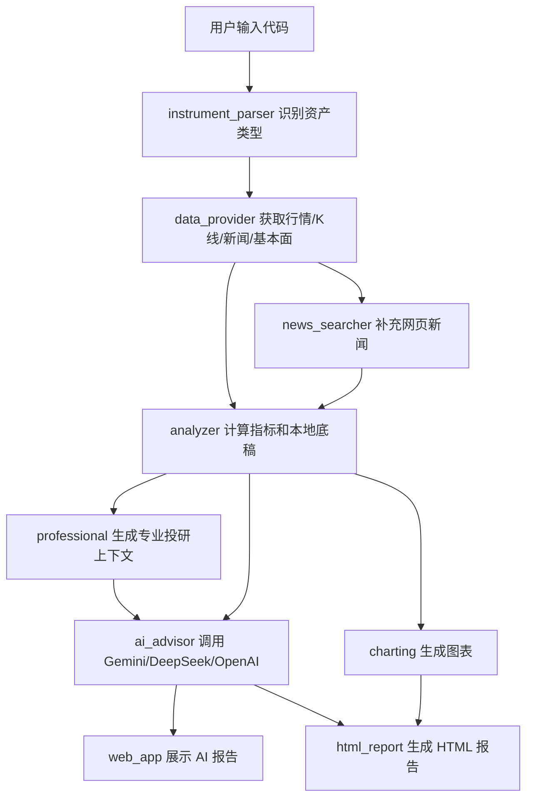

# 系统架构说明

当前项目采用“数据层、分析层、AI 层、展示层”分层设计。这样做的好处是：以后如果要换数据源、换 AI、加量化回测，不需要把所有代码搅在一起改。

## 1. 总体数据流

## 2. 入口层

### `web_app.py`

本地网页入口，使用 Streamlit。负责：

- 显示输入框、资产类型、AI provider、报告深度等控件。
- 调用 `main.analyze_symbol()` 获取数据底稿。
- 调用 `AiAdvisor` 生成 AI 报告。
- 展示图表、新闻链接、HTML 报告路径。

日常使用优先走这个入口。

### `main.py`

CLI 入口，也是项目的通用流程编排文件。负责：

- 读取 `.env`。
- 解析命令行参数。
- 根据输入代码识别资产类型。
- 调用数据层、分析层、AI 层。
- 在 CLI 中进入连续问答模式。

网页和 CLI 都复用了这里的核心流程，所以它是理解项目运行顺序的关键文件。

## 3. 数据层

### `stock_analyse/data_provider.py`

这是项目里最“接近外部世界”的文件。它负责和 AKShare 交互，并把不同接口返回的字段整理成统一格式。

主要职责：

- 获取股票、ETF、期货实时行情。
- 获取历史日线和分钟线。
- 获取股票基本面、估值和同行估值。
- 获取期货现货价格、基差、结算数据、持仓排名。
- 获取 AKShare 内置新闻。
- 遇到接口失败时提供备用路径或错误提示。

这个文件最容易因为上游接口变化而需要维护。

### `stock_analyse/news_searcher.py`

免费网页新闻搜索模块。它不依赖昂贵新闻 API，而是根据标的生成关键词，从公开新闻源检索标题、时间、来源、摘要和链接。

AI 报告会要求区分：

- 强相关新闻
- 弱相关或背景新闻
- 市场背景新闻

这样可以减少把无关新闻误判为交易依据的问题。

## 4. 分析层

### `stock_analyse/indicators.py`

技术指标工具箱，负责计算：

- 均线
- RSI
- MACD
- 布林带

新增技术指标通常先从这个文件开始。

### `stock_analyse/analyzer.py`

本地分析器。它不是最终投资顾问，而是给 AI 准备数据底稿。

主要输出：

- 当前价格、涨跌幅、成交量。
- MA20、MA60、RSI、MACD 等指标。
- 支撑位和压力位。
- 本地规则评分。
- 风险提示。
- 给 AI 的结构化 payload。

注意：当前本地评分只是辅助，不等于专业量化模型。

### `stock_analyse/professional.py`

专业投研上下文模块。它会把原始数据进一步整理成更像投资者会看的语言：

- 数据时间是否一致。
- 新闻是否强相关。
- 期货现货/基差解读。
- 期货持仓排名聚合。
- 多空计划的入场、止损、目标、风险收益比。

这个文件是从“普通 AI 分析”走向“专业投研报告”的关键。

## 5. AI 层

### `stock_analyse/ai_advisor.py`

统一 AI 调用模块。负责：

- 选择 Gemini、DeepSeek 或 OpenAI。
- 读取 `.env` 中的 key 和代理配置。
- 组织系统提示词和用户数据。
- 控制输出结构。
- 处理连接失败、限额不足、空响应等错误。

当前设计原则是：AI 是主分析者，但必须引用数据底稿，不能凭空编结论。

## 6. 展示层

### `stock_analyse/charting.py`

生成 Plotly 图表：

- K 线
- 均线
- 成交量
- MACD
- RSI
- 支撑压力线

### `stock_analyse/html_report.py`

生成可保存的 HTML 图文报告。包含：

- AI 投资报告文本。
- 图表。
- 数据底稿。
- 新闻来源和链接。
- 风险提示。

## 7. 数据结构层

### `stock_analyse/models.py`

定义核心数据结构，例如：

- `StockQuote`
- `AnalysisResult`
- `NewsItem`
- `Prediction`

这些对象让不同模块之间传数据时更清楚，避免到处传杂乱的 `dict`。

### `stock_analyse/instrument_parser.py`

负责识别代码类型：

- `600519` -> 股票
- `510300` -> ETF
- `LC2609` -> 期货
- `stock:600519` -> 明确股票
- `etf:510300` -> 明确 ETF
- `futures:LC2609` -> 明确期货

之前“从 A 股切到期货复用旧接口”的问题，本质上就是资产类型识别和状态复用问题。现在每次输入新代码都会重新识别。

## 8. 测试层

### `tests/test_analyzer.py`

当前测试覆盖：

- 资产类型识别。
- 基础分析流程。
- AI payload 是否包含关键字段。
- HTML 报告能否生成。

下一阶段量化升级后，需要新增：

- 因子计算测试。
- 回测结果测试。
- 信号评分测试。
- 期货专属数据测试。

## 9. 设计原则

- AI 负责综合判断，本地代码负责提供清楚、可复核的数据底稿。
- 所有真实 key 只放 `.env`。
- 免费数据源要标注局限，不假装成专业终端。
- 每次分析都重新识别资产类型。
- 报告必须提供“看错条件”和“风险收益比”。
- 后续量化升级必须以历史回测验证为核心。
